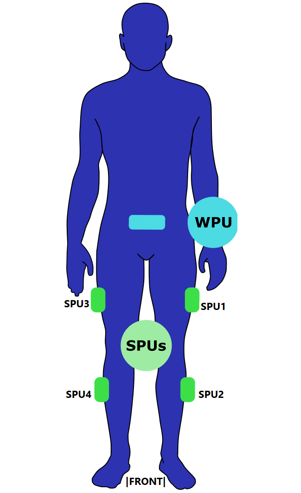

# LSTM_GRU_RNN_human-activity-recognition
This repository uses data collected by wearable sensors to train AI models to recognize human activities. 

WPU: Sensor responsible for collecting the data from the four spu sensors. 
SPUs: Sensors inform the user's spatial location.

